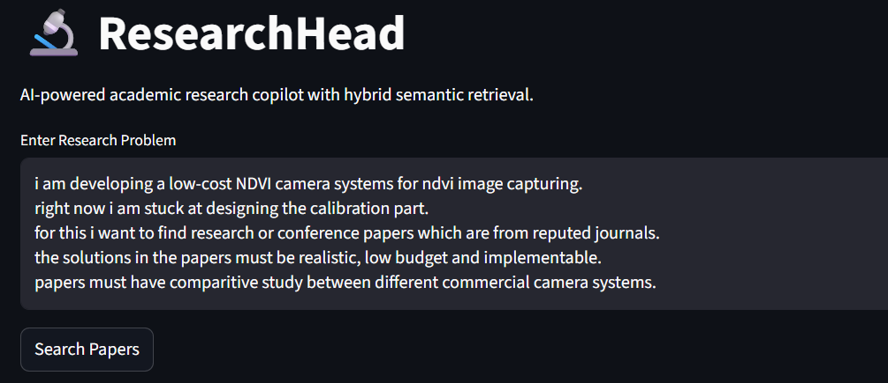
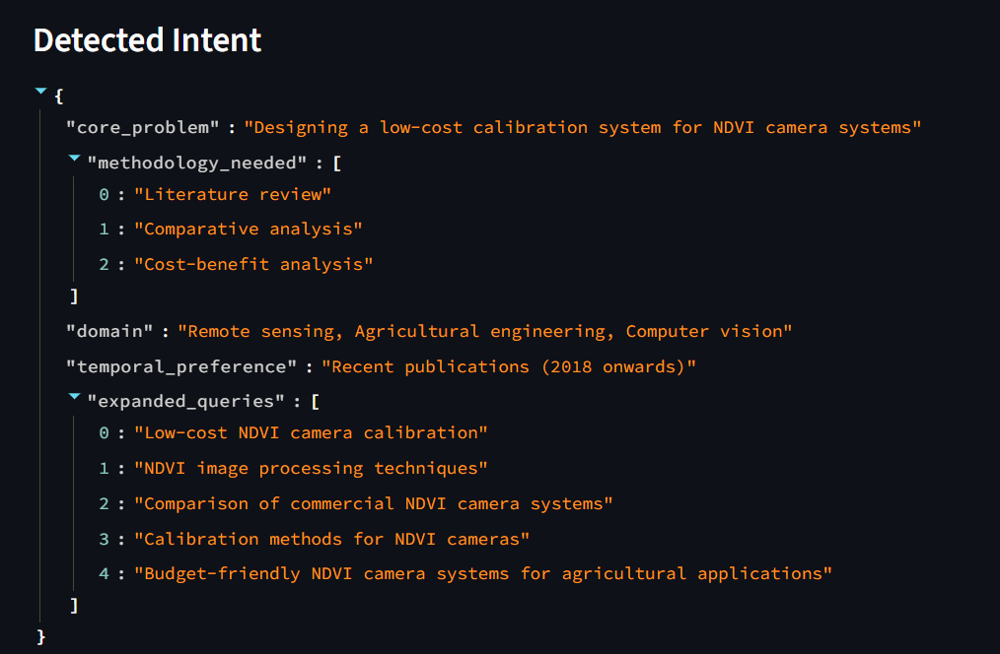
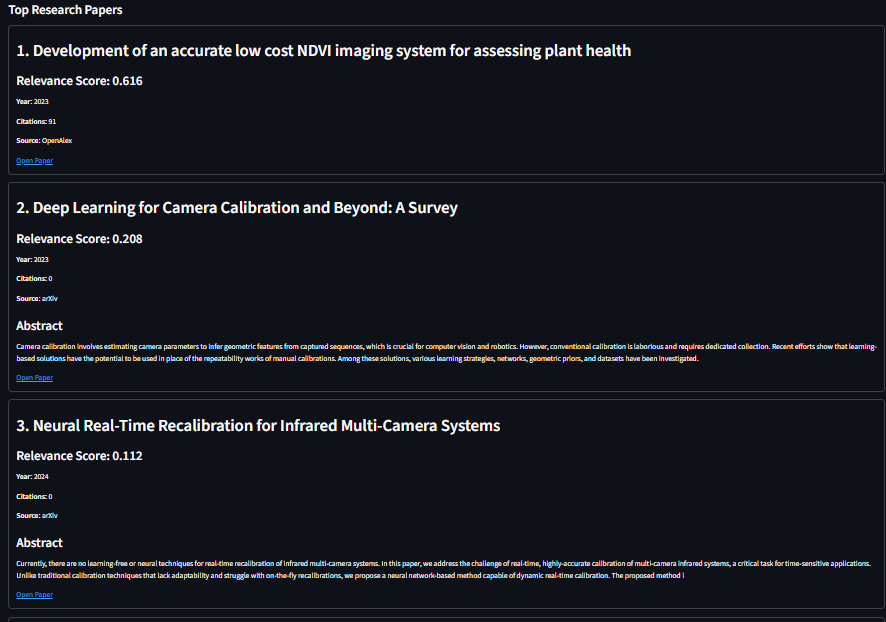

# ResearchHead

## Hybrid Semantic Academic Retrieval System

ResearchHead is an AI-powered academic research copilot designed to improve research paper discovery using hybrid retrieval techniques, semantic embeddings, reranking models, and multi-source academic APIs.

Unlike traditional keyword-based academic search systems, ResearchHead focuses on understanding the semantic intent behind research queries and retrieving contextually relevant papers from multiple academic sources.

The system combines:

* Intent Extraction
* Query Expansion
* Dense Semantic Retrieval
* BM25 Sparse Retrieval
* Reciprocal Rank Fusion (RRF)
* Cross-Encoder Reranking
* Multi-source Academic Retrieval

to create a modern academic retrieval pipeline.

---

# Features

## Intent-Aware Research Search

Uses an LLM-based intent extraction system to understand:

* Core research problem
* Domain
* Methodology requirements
* Temporal preferences
* Semantic query expansions

---

## Multi-Source Academic Retrieval

Retrieves papers from:

* arXiv
* OpenAlex
* Semantic Scholar

This improves:

* paper diversity
* retrieval coverage
* semantic breadth

---

## Hybrid Retrieval Architecture

Combines:

* Dense vector retrieval
* BM25 sparse retrieval

using:

* Reciprocal Rank Fusion (RRF)

to improve retrieval quality and semantic matching.

---

## Semantic Vector Search

Uses:

* BAAI/bge-base-en-v1.5 embeddings
* ChromaDB vector database

for semantic paper retrieval.

---

## Cross-Encoder Reranking

Uses:

* BAAI/bge-reranker-v2-m3

to improve final ranking precision and prioritize highly relevant papers.

---

## Explainable Research Results

Displays:

* relevance score
* source
* year
* citation count
* abstract preview

for each retrieved paper.

---

# System Architecture

```text
User Query
    ↓
Intent Extraction (LLM)
    ↓
Query Expansion
    ↓
Multi-source Retrieval
(arXiv + OpenAlex + Semantic Scholar)
    ↓
ChromaDB Vector Storage
    ↓
Dense Semantic Retrieval
    ↓
BM25 Sparse Retrieval
    ↓
Reciprocal Rank Fusion (RRF)
    ↓
Cross-Encoder Reranking
    ↓
Final Ranked Research Papers
```

---

# Tech Stack

| Component        | Technology                        |
| ---------------- | --------------------------------- |
| Frontend         | Streamlit                         |
| LLM              | Groq API                          |
| Embeddings       | BAAI/bge-base-en-v1.5             |
| Reranker         | BAAI/bge-reranker-v2-m3           |
| Vector Database  | ChromaDB                          |
| Sparse Retrieval | rank-bm25                         |
| Academic APIs    | arXiv, OpenAlex, Semantic Scholar |
| Backend          | Python                            |

---

# Folder Structure

```text
RESEARCHHEAD/
│
├── agents/
│   └── intent_agent.py
│
├── retrieval/
│   ├── retriever.py
│   ├── hybrid_search.py
│   └── reranker.py
│
├── vectorstore/
│   └── chroma_manager.py
│
├── tests/
│   ├── test_intent.py
│   ├── test_retriever.py
│   ├── test_chroma.py
│   └── test_reranker.py
│
├── assets/
│
├── data/
│
├── app.py
├── config.py
├── requirements.txt
├── .gitignore
└── README.md
```

---

# Installation

## 1. Clone Repository

```bash
git clone https://github.com/yourusername/researchhead.git

cd researchhead
```

---

## 2. Create Virtual Environment

### Windows

```bash
python -m venv venv

venv\Scripts\activate
```

### Linux / Mac

```bash
python3 -m venv venv

source venv/bin/activate
```

---

## 3. Install Dependencies

```bash
pip install -r requirements.txt
```

---

## 4. Configure Environment Variables

Create a `.env` file:

```env
GROQ_API_KEY=your_api_key_here
```

---

## 5. Run Application

```bash
streamlit run app.py
```

---

# Example Queries

## Medical Imaging

```text
I want papers about low-data medical image classification using transformers
```

---

## NLP

```text
Recent papers on low-resource NLP using contrastive learning
```

---

## Computer Vision

```text
How are diffusion models used in image generation and editing?
```

---

## Remote Sensing

```text
Estimating carbon storage in forests from satellite images using deep learning
```

---

# Demo Screenshots

## User Query Input

Add screenshot:

```text
assets/query_input.png
```

Markdown example:




---

## Intent Extraction Output

Add screenshot showing:

* detected core problem
* domain
* methodology
* expanded queries

Example:




---

## Top Research Results

Add screenshot showing:

* top retrieved papers
* reranked outputs
* relevance scores
* source labels
* abstracts

Example:



---

# Example Retrieval Flow

## User Query

```text
Estimating carbon storage in forests from satellite images using deep learning
```

---

## Detected Intent

```json
{
  "core_problem": "Estimating carbon storage in forests using satellite imagery",
  "methodology_needed": [
    "deep learning",
    "remote sensing",
    "computer vision"
  ],
  "domain": "environmental monitoring and remote sensing",
  "temporal_preference": "foundational understanding",
  "expanded_queries": [
    "forest biomass estimation using deep learning",
    "remote sensing for carbon sequestration",
    "satellite image analysis for forest monitoring"
  ]
}
```

---

## Top Retrieved Research Papers

### 1. Tackling the Overestimation of Forest Carbon with Deep Learning and Aerial Imagery

* Source: arXiv
* Relevance Score: 0.339
* Focus:
  Forest carbon estimation using aerial imagery and deep learning techniques.

---

### 2. Assessing Ensemble Models for Carbon Sequestration and Storage Estimation in Forests Using Remote Sensing Data

* Source: OpenAlex
* Relevance Score: 0.167
* Focus:
  Carbon sequestration estimation through ensemble learning and remote sensing.

---

### 3. ICESat-2 and Landsat for Mapping Forest Aboveground Biomass

* Source: OpenAlex
* Relevance Score: 0.092
* Focus:
  Biomass estimation using satellite sensor fusion and remote sensing workflows.

---

# Example Capabilities

## Intent Extraction

The system can infer:

* research domain
* methodology
* semantic context
* related concepts

even when users do not explicitly mention technical keywords.

---

## Semantic Understanding

Input:

```text
My transformer model overfits because I have very little training data
```

The system can infer:

* few-shot learning
* transfer learning
* parameter-efficient fine-tuning
* low-data transformers

without exact keyword matching.

---

# Current Capabilities

* Semantic academic retrieval
* Hybrid retrieval pipeline
* Dense embeddings
* BM25 retrieval
* Query expansion
* Cross-encoder reranking
* Explainable retrieval UI
* Multi-source retrieval
* Vector similarity search

---

# Future Improvements

* Citation graph traversal
* Async retrieval pipeline
* Session memory
* User feedback learning
* Paper summarization
* Retrieval evaluation metrics
* Research recommendation engine
* Deployment support
* Streaming results
* Personalized retrieval

---

# Why This Project?

Traditional academic search systems rely heavily on keyword matching and often fail to understand semantic intent.

ResearchHead explores how hybrid retrieval systems, semantic embeddings, reranking models, and vector databases can improve academic research discovery and contextual paper retrieval.

The project was built to explore:

* Information Retrieval (IR)
* Semantic Search
* Retrieval-Augmented Systems
* Dense + Sparse Hybrid Retrieval
* AI-powered Research Discovery

---

# Key Concepts Used

* Dense Retrieval
* Sparse Retrieval
* BM25
* Reciprocal Rank Fusion
* Cross-Encoder Reranking
* Semantic Embeddings
* Vector Databases
* Intent Extraction
* Query Expansion
* Retrieval Engineering

---

# Author

Harshal Lokhande

Final Year EXTC Engineering Student

Interested in:

* AI Engineering
* Information Retrieval
* NLP Systems
* Semantic Search
* AI Infrastructure

---

# License

MIT License

---

# Acknowledgements

* arXiv API
* OpenAlex API
* Semantic Scholar
* HuggingFace
* Sentence Transformers
* Streamlit
* ChromaDB
